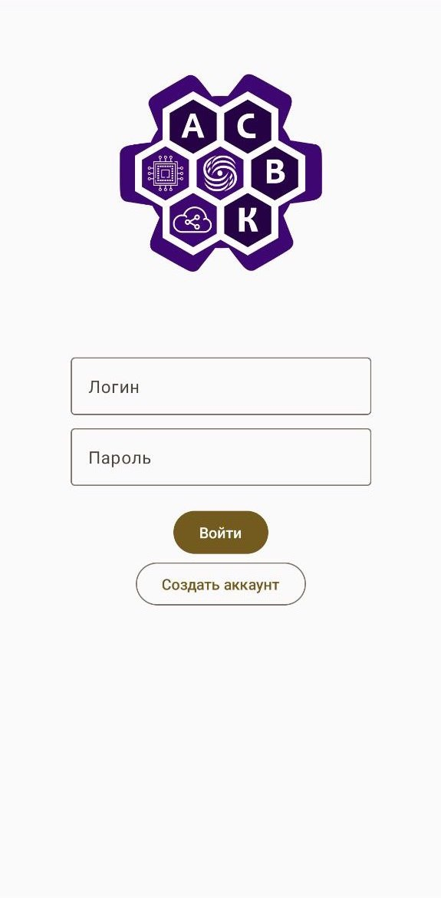
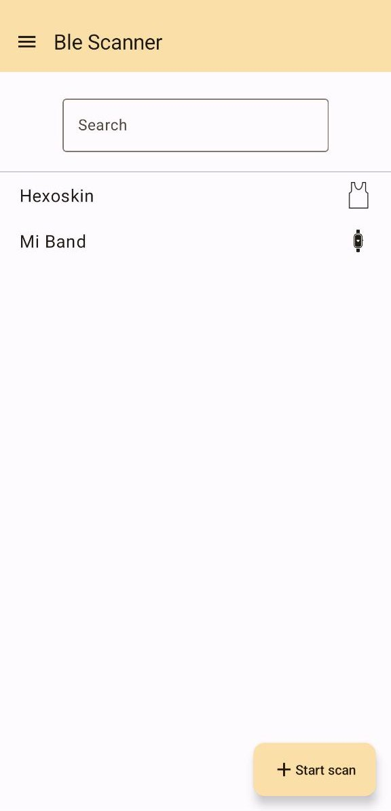
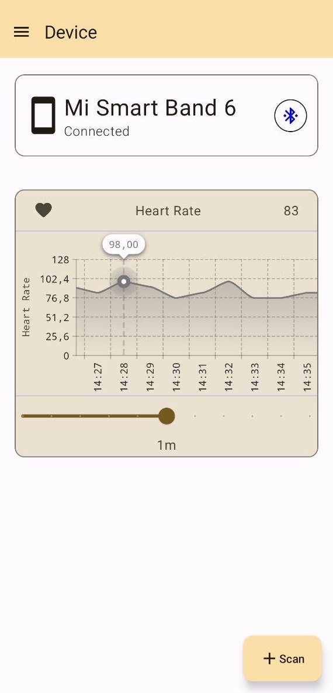

# IoMT Health Center

### Abstract

This graduation thesis aims to improve the existing client-side of a service for collecting and processing medical telemetry data from Internet of Things devices.

The study explores the scalability issue of the client-side in the area of simultaneous interaction with multiple Internet of Medical Things sensors.
An architectural solution is proposed that allows reading data from sensors in the background, and resource consumption is investigated depending on the number of connected devices.

### What's inside
Application is used to read data from BLE devices and send it to [server](https://github.com/IoMT-LVK/iomt_backend)

### Requirements:
 * Android 14
 * BLE support

### Features
 * Credential saving
 * Dynamic theme based on `MaterialYou`
 * Caching data on device
 * Plots based on cached data
 * `MQTT` is used for data synchronization with server
 * Auto cleanup each 24 hours

### Some screenshots

